### Hi there 👋
<!--
- 🔭 I’m currently working on ...
- 🌱 I’m currently learning ...
- 👯 I’m looking to collaborate on ...
- 🤔 I’m looking for help with ...
- 💬 Ask me about ...
- 📫 How to reach me: ...
- 😄 Pronouns: ...
- ⚡ Fun fact: ...
-->

<!-- <h3 align="left">Connect with me:</h3>

-->
<!--

-->
### :moyai: Bug bounty

- HackerOne [https://hackerone.com/baadmaro](https://hackerone.com/baadmaro)

### :memo: Latest blog posts

Blog : https://baadmaro.github.io/
<!-- BLOG-POST-LIST:START -->
- [DGSSI CTF PRO 2024 - Italy Writeup](https://baadmaro.github.io/posts/DGSSI-CTF-PRO-Italy-Writeup/)
- [Discourse CVE-2023-47119 - Building a CVE POC from commits changes](https://baadmaro.github.io/posts/Discourse-CVE-2023-47119-Building-a-CVE-POC-from-commits-changes/)
- [Bypass captcha using OCR on Dolibarr login page](https://baadmaro.github.io/posts/Bypass-captcha-using-OCR-on-Dolibarr-login-page/)
- [Android Applications Pentesting, Intentional Exercise from Hackerone platform](https://baadmaro.github.io/posts/Android-Applications-Pentesting,-Intentional-Exercise-from-Hackerone-platform/)
- [IoT Pentesting with Teltonika RUT9XX](https://baadmaro.github.io/posts/IoT-Pentesting-with-Teltonika-RUT9XX/)
<!-- BLOG-POST-LIST:END -->

